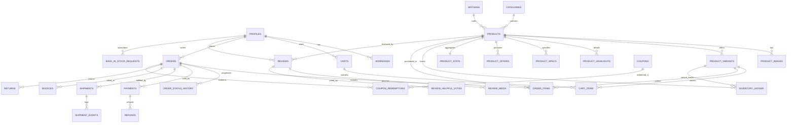

# B0 – Audit & Architecture Report: Anu Atelier Backend

**Project:** Anu Atelier – Handcrafted Indian Magic & Artisan Crafts  
**Branch:** `backend`  
**Phase:** B0 (Audit & Architecture – Read-only baseline)  
**Date:** September 2026  
**Status:** COMPLETE (Pending User Approval to begin B1)

---

## 1. Current-State Audit Report

### 1.1 Coexisting Front-End Architecture
1. **Legacy HTML/CSS/JS (`legacy/` & root legacy files)**:
   - `index.html`, `product.html`, `category.html`, `seller.html`, `profile.html`.
   - Uses `script.js` which manages a client-side cart array in `localStorage.getItem('anu_cart')`.
   - Mock backend endpoint `http://localhost:3000/api` with an Express server (`legacy/server.js`) that stored products into a local `products.json` file.
   - When the backend was offline, the "Add Craft" form in `legacy/seller.html` encoded images into raw Base64 strings and stored them in `localStorage.getItem('anu_products_fallback')`.
2. **React + Vite + Tailwind Application (`src/`)**:
   - Modern React SPA built with Zustand stores:
     - `useCartStore`: manages cart items in `localStorage.getItem('anu_cart')`. All subtotal, delivery fee, and discount calculations are performed in the browser.
     - `useProductStore`: reads from hardcoded initial constants (`INITIAL_PRODUCTS`) and merges custom items from `localStorage.getItem('anu_published_products')`.
     - `useWishlistStore`: persists product ID arrays in `localStorage.getItem('anu_wishlist')`.
     - `useAuthStore`: attempts Supabase Auth, but falls back to `localStorage.getItem('anu_auth_user')`.
   - **Critical Vulnerability Flagged**: `useAuthStore.ts` contains a hardcoded admin bypass: `session.user.email?.toLowerCase() === 'anushka32199@gmail.com'`. In our backend architecture, roles will reside strictly in `profiles.role`, validated on the server via RLS and PostgreSQL functions (`is_admin()`), with no client-side overrides.

### 1.2 LocalStorage Keys Inventory
| Key | Used In | Content | Vulnerability / Issue |
|---|---|---|---|
| `anu_cart` | Legacy & React | Array of cart items `{ id, name, price, qty, image, ... }` | Zero validation; price and stock are client-controlled; no atomic reservation. |
| `anu_wishlist` | React | Array of product ID strings | Local only; not synced across customer devices. |
| `anu_published_products` | React `useProductStore` | Array of newly added product objects | Stored only in creator's browser; other customers cannot see or buy these crafts. |
| `anu_products_fallback` | Legacy `seller.html` | Array of products with Base64 images | Massive Base64 strings quickly breach 5MB browser storage limits. |
| `anu_auth_user` | React `useAuthStore` | Plaintext JSON user profile | Insecure mock session; anyone can edit localStorage to forge identity. |
| `anu_country`, `anu_lang` | Footer Preference | ISO country code & language code | Safe regional UI preference. |

### 1.3 Catalog, Product Fields & Image Assets Audit
1. **Existing Categories (3)**:
   - `terracotta-clay` (Terracotta & Clay Items)
   - `embroidered-clothes` (Embroidered & Hand-Stitched)
   - `other-handicrafts` (Other Handicrafts)
2. **Existing Seed Products (9)**:
   - Seeded in `src/constants/index.ts` and `supabase/migrations/002_seed_data.sql`.
   - Prices stored as floating rupee numbers (`499`, `799`, `2499`), violating Invariant 1 (integer paise `bigint`).
3. **HOTLINKED & THIRD-PARTY MEDIA AUDIT (CRITICAL)**:
   - **Google Cached Thumbnails**: 8 out of 9 products in `products.json` and `src/constants/index.ts` use Google Images cache URLs:
     - `https://encrypted-tbn0.gstatic.com/images?q=tbn:ANd9GcSsTRyROcOR6uy...`
     - `https://encrypted-tbn0.gstatic.com/images?q=tbn:ANd9GcRpijLGyKIV-d9...`
     - `https://encrypted-tbn0.gstatic.com/images?q=tbn:ANd9GcQHAZqy4uNX9_y...`
     - `https://encrypted-tbn0.gstatic.com/images?q=tbn:ANd9GcR4_rZRO56o2R8...`
     - `https://encrypted-tbn0.gstatic.com/images?q=tbn:ANd9GcQXr2u7o7lkBiP...`
     - `https://encrypted-tbn0.gstatic.com/images?q=tbn:ANd9GcSmvGxiNqCibZW...`
     - `https://encrypted-tbn0.gstatic.com/images?q=tbn:ANd9GcQdN7QGCSpJx-J...`
     - `https://encrypted-tbn0.gstatic.com/images?q=tbn:ANd9GcS1_b2ZJsjCwOH...`
     - `https://encrypted-tbn0.gstatic.com/images?q=tbn:ANd9GcTFDLuh12PswfH...`
     - **Risk**: These URLs are temporary Google search cache links that expire, degrade to low resolution (150x150), and may infringe copyright.
     - **Recommendation**: In Phase B2, download and upload these into our dedicated Supabase `product-media` bucket or replace with authentic high-resolution artisan photography.
   - **Unsplash Media**: Category hero banners use Unsplash images (`photo-1578749556568-bc2c40e68b61`, etc.). Safe for commercial use under Unsplash license, but should be mirrored in Supabase Storage for reliability.
   - **Local Brand Assets**: `/img/promo/promo-terracotta.jpg`, `promo-clothing.jpg`, `promo-handicrafts.jpg`, and `/img/hero-artisan.jpg` are committed in the repository and ready for production asset hosting.

---

## 2. Target Database Architecture & ERD

### 2.1 Entity Relationship Diagram (Mermaid)



### 2.2 Table Inventory (36 Tables)
1. **Identity & Access**:
   - `profiles`: Extends Supabase auth; stores `role` (`customer`, `staff`, `admin`), `is_blocked`, `cod_blocked`, safe profile info.
2. **Catalog & Media**:
   - `categories`: Hierarchical categories with slugs, descriptions, display order.
   - `artisans`: Traditional Indian artisans bio, photos, craft locations, stories.
   - `products`: Published, draft, and archived handmade crafts with paise pricing (`price_paise`, `mrp_paise`), SKU, HSN code, GST rate, lead time, dimensions, return flags.
   - `product_images`: Multi-angle photos stored in `product-media` bucket.
   - `product_variants`: Color, size, SKU, price override, variant stock.
   - `product_highlights`: Rich icon key and bullet highlights.
   - `product_specs`: Key-value craftsmanship specifications.
   - `product_offers`: Time-bounded sale prices and flash deals.
   - `product_stats`: Verified buyer counts, average rating, 1-5 star histogram (trigger-maintained).
   - `slug_redirects`: Handles slug updates so old URLs redirect seamlessly.
3. **Inventory & Warehouse**:
   - `inventory_ledger`: Immutable audit trail for every single stock change (`purchase`, `restock`, `cancel_restock`, `return_restock`, `manual_adjustment`).
4. **Checkout, Pricing & Cart**:
   - `addresses`: Up to 10 verified Indian delivery addresses per user with PIN code validation.
   - `carts`: Server-side persistent carts for authenticated users.
   - `cart_items`: Cart line items with quantity, variant, and personalization notes.
   - `coupons`: Percentage, flat, or free delivery codes with min cart values, usage caps, and scopes.
   - `coupon_redemptions`: Audit record of exact coupon usage per order.
5. **Orders & Fulfilment**:
   - `orders`: Master order record with human-readable numbers (`AA-26-XXXXXX`), financial year tracking, exact paise totals, idempotency keys, and UTM attribution.
   - `order_items`: Full historical snapshot of product title, SKU, variant, image, unit price, MRP, HSN, tax rate, and tax amount.
   - `order_status_history`: Timestamped lifecycle log of every state transition.
   - `shipments`: Courier, tracking numbers, tracking URLs, and dispatch timestamps.
   - `shipment_events`: Granular checkpoint logs from dispatch to delivery.
   - `returns`: Return/replacement requests, photographic evidence, inspection logs, and restock decisions.
6. **Payments & Billing**:
   - `payments`: Razorpay transaction IDs, payment methods (UPI/Card/COD), amounts, and payment verification records.
   - `refunds`: Full and partial refund requests, provider refund IDs, and accounting reasons.
   - `webhook_events`: Idempotent raw payload store for Razorpay webhooks with duplicate prevention.
   - `invoices`: Sequential financial year tax invoices, CGST/SGST/IGST breakdown, and PDF storage paths.
7. **Social Proof & Customer Engagement**:
   - `reviews`: Verified-purchase customer reviews with rating (1-5), moderation status, and report counter.
   - `review_media`: Customer upload bucket references (`review-media`).
   - `review_helpful_votes`: Single vote per user per review.
   - `back_in_stock_requests`: Customer waitlist for out-of-stock handcrafted products.
   - `enquiries`: Contact form and custom artisan order requests.
8. **Operations & System**:
   - `pincodes`: Serviceable Indian postal codes with COD availability and delivery ETA min/max days.
   - `site_settings`: JSON-schema validated operational settings (delivery fees, thresholds, contact info).
   - `email_outbox`: Transactional email queue decoupled from order transactions (Resend adapter).
   - `audit_log`: Automatic change-data-capture for administrative modifications.

---

## 3. State Machines

### 3.1 Order Lifecycle State Machine
```
[pending_payment] ---> (Payment successful) ---------> [placed]
      |               (COD selected)                |
      |                                              v
      +--------------> (Payment failed) ------------> [failed]
      |               (Expiry 30 min)               ^
      +--------------> (User cancels) -------------> [cancelled]
                                                     ^
[placed] ------------> [confirmed] ------------------+ (Admin/Customer cancels)
                           |
                           v
                       [packed] --------------------+ (Admin cancels)
                           |
                           v
                       [shipped]
                           |
                           +------------------------+
                           v                        v
                   [out_for_delivery]             [rto] (Return to Origin)
                           |                        ^
                           v                        |
                      [delivered] ------------------+ (Undelivered)
```

### 3.2 Payment Lifecycle State Machine
- **Online (Razorpay)**:
  `pending -> paid`
  `pending -> failed`
  `paid -> refund_pending -> partially_refunded | refunded`
- **Cash on Delivery (COD)**:
  `cod_due -> cod_collected (upon delivery)`
  `cod_due -> failed (RTO / rejected at doorstep)`

### 3.3 Return & Replacement State Machine
```
[requested] ---> (Admin approves) ---> [approved] ---> [pickup_scheduled]
     |                                                       |
     v                                                       v
 [rejected]                                            [item_received]
                                                             |
                                                             v
                                                        [inspected]
                                                             |
                           +---------------------------------+---------------------------------+
                           v                                                                   v
            [replacement_dispatched]                                                    [refund_processed]
```

---

## 4. API & Database RPC Interface

### 4.1 Client-Safe Database RPCs (Callable via Supabase JS)
| RPC Function | Access | Purpose |
|---|---|---|
| `list_products(filters, sort, cursor)` | Public / Anon | Returns published products with cursor pagination, price filters, category filters. |
| `search_products(query, filters, sort, cursor)` | Public / Anon | Trigram + Full-Text weighted search (`title` > `tags` > `description`). |
| `search_suggestions(prefix)` | Public / Anon | Fast typeahead suggestions for search overlay. |
| `get_product_detail(slug_or_id)` | Public / Anon | Single round-trip returning product, images, variants, highlights, specs, active offer, stats, related crafts. |
| `get_related_products(product_id, limit)` | Public / Anon | Returns curated crafts from same category or artisan. |
| `get_home_feed()` | Public / Anon | Returns hero banners, fresh from workshop, bestsellers, promotional collections. |
| `check_pincode(pin, product_id?)` | Public / Anon | Checks 6-digit Indian PIN code serviceability, COD eligibility, and estimated delivery days. |
| `calculate_totals(items, coupon, pin, method)` | Public / Anon | Single source of truth for pricing: MRP, discount, coupon, delivery fee, COD fee, tax, grand total. |
| `place_order(payload, idempotency_key)` | Authenticated | Atomic order transaction: locks stock, reprices, validates rules, creates order + items, decrements stock, queues email. |
| `cancel_order(order_id, reason)` | Authenticated | Customer cancellation (allowed only before shipment); restocks ledger and initiates refund. |
| `get_order_tracking(order_id)` | Authenticated | Returns order status timeline, shipment tracking number, and courier checkpoint events. |
| `submit_review(payload)` | Authenticated | Verified purchase check, rating (1-5), and atomic update of product stats. |
| `vote_review_helpful(review_id)` | Authenticated | Casts helpful vote on review with duplicate prevention. |
| `merge_guest_cart(local_items)` | Authenticated | Merges guest localStorage cart into persistent user cart upon login. |

### 4.2 Serverless API Endpoints (`/api/*` on Vercel)
| Method & Route | Access | Purpose |
|---|---|---|
| `GET /api/health` | Public | System uptime check, database connection status, and version probe. |
| `POST /api/payments/create` | Authenticated | Validates order from DB and creates authentic Razorpay order with exact paise amount. |
| `POST /api/payments/verify` | Authenticated | Verifies Razorpay HMAC signature (`order_id\|payment_id`), marks order paid idempotently. |
| `POST /api/webhooks/razorpay` | Public (Signed) | Validates raw webhook body with secret, deduplicates by event ID, triggers order fulfilment. |
| `POST /api/admin/refunds` | Admin Only | Initiates full or partial refund via Razorpay API, updates payment ledger and order state. |
| `GET /api/invoices/:id/download` | Authenticated (Own/Admin) | Generates and streams signed GST tax invoice PDF. |
| `POST /api/cron/expire-orders` | Cron Secret | Cancels unpaid online orders older than 30 min, restores stock to inventory ledger. |
| `POST /api/cron/reconcile-payments` | Cron Secret | Polls Razorpay API for unresolved pending transactions and reconciles discrepancies. |
| `POST /api/cron/send-emails` | Cron Secret | Processes `email_outbox` queue with exponential backoff via Resend API. |
| `POST /api/cron/daily-reports` | Cron Secret | Generates and emails daily sales summary, low stock digest, and accounting totals to admin. |
| `POST /api/cron/cleanup-orphans` | Cron Secret | Deletes orphaned images in Supabase Storage older than 7 days. |

---

## 5. Environment Variables Matrix

All secret credentials reside strictly on serverless execution contexts; **never** in client code, git, or browser bundles.

| Variable Name | Required In | Purpose | Secret? |
|---|---|---|---|
| `APP_ENV` | Dev & Prod | `development` or `production` environment switch | No |
| `APP_BASE_URL` | Dev & Prod | e.g. `http://localhost:5173` or `https://anuatelier.com` | No |
| `SUPABASE_URL` | Dev & Prod | Project HTTPS endpoint | No |
| `SUPABASE_ANON_KEY` | Dev & Prod | Public anonymous client key (RLS enforced) | No |
| `SUPABASE_SERVICE_ROLE_KEY` | Server Only | Administrative database access for webhooks & crons | **YES (CRITICAL)** |
| `RAZORPAY_KEY_ID` | Dev & Prod | Public key for frontend Razorpay Checkout | No |
| `RAZORPAY_KEY_SECRET` | Server Only | Server secret for payment creation & HMAC verification | **YES (CRITICAL)** |
| `RAZORPAY_WEBHOOK_SECRET` | Server Only | Secret for raw webhook payload HMAC signature check | **YES (CRITICAL)** |
| `EMAIL_PROVIDER_API_KEY` | Server Only | Resend API key for transactional emails | **YES (CRITICAL)** |
| `EMAIL_FROM` | Dev & Prod | Verified sender: `orders@anuatelier.com` or `onboarding@resend.dev` | No |
| `ADMIN_ALERT_EMAIL` | Server Only | Admin email receiving low stock & mismatch alerts | No |
| `CRON_SECRET` | Server Only | Bearer token protecting background cron endpoints | **YES (CRITICAL)** |
| `SENTRY_DSN` | Server Only | Error tracking & performance monitoring (Optional) | No |
| `TURNSTILE_SECRET_KEY` | Server Only | Cloudflare Turnstile anti-bot verification key (Optional) | **YES** |

---

## 6. External Accounts & Keys Setup Guide (Click-by-Click)

The user must create the following accounts and keys before Phase B4/B7:

### 6.1 Supabase Setup (Dev Project first)
1. Go to **[https://supabase.com](https://supabase.com)** and log in / sign up with GitHub or Google.
2. Click **New project** -> Name: `anu-atelier-dev` -> Select Region: **South Asia (Mumbai) `ap-south-1`**.
3. Choose a strong database password and store it in a password manager.
4. Once provisioned, navigate to **Project Settings** -> **API**:
   - Copy **Project URL** (`https://<project-ref>.supabase.co`).
   - Copy **Project API keys**: `anon` (public) and `service_role` (secret).
5. (In Phase B7, repeat this step once more to create `anu-atelier-prod`).

### 6.2 Razorpay Setup (Test Mode)
1. Go to **[https://razorpay.com](https://razorpay.com)** and sign up for a business account.
2. In the dashboard top bar, ensure toggle is set to **Test Mode**.
3. Navigate to **Account & Settings** -> **API Keys** -> Click **Generate Test Key**.
   - Copy `Key Id` (starts with `rzp_test_...`).
   - Copy `Key Secret`.
4. Navigate to **Account & Settings** -> **Webhooks** -> Click **Add New Webhook**:
   - Webhook URL: `https://<your-vercel-domain>/api/webhooks/razorpay` (or ngrok for local testing).
   - Secret: Create a random 24-character string (save as `RAZORPAY_WEBHOOK_SECRET`).
   - Active Events: `order.paid`, `payment.captured`, `payment.failed`, `refund.processed`.
5. *Live Mode Activation Requirements (for B7)*:
   - Business PAN card, business bank account details (IFSC, Account number), GSTIN (if registered), address proof, and website compliance pages (Terms, Privacy, Refund/Cancellation, Contact Us with grievance officer).

### 6.3 Resend Setup (Transactional Emails)
1. Go to **[https://resend.com](https://resend.com)** and sign up.
2. Go to **API Keys** -> Click **Create API Key** -> Name: `anu-atelier-dev` -> Copy key (`re_...`).
3. In dev mode, Resend allows sending to your own email address immediately using `onboarding@resend.dev`.
4. For production sending (`orders@anuatelier.com`), click **Domains** -> **Add Domain** -> Add the 3 DNS records (TXT for DKIM, TXT for SPF, MX) to your domain registrar (e.g. GoDaddy/Namecheap/Cloudflare).

### 6.4 Vercel Environment Configuration
1. Go to **[https://vercel.com](https://vercel.com)** -> Select the Anu Atelier project.
2. Navigate to **Settings** -> **Environment Variables**.
3. Add the keys from Section 5, checking the boxes for **Development** and **Preview** for dev keys, and reserving **Production** for production launch keys.

---

## 7. Risks & Assumptions

1. **Hotlinked Images Risk**: 8 of the 9 current catalog items use temporary Google thumbnails (`encrypted-tbn0.gstatic.com`). They will be archived and migrated to Supabase Storage in B2 to prevent broken product cards.
2. **Client-side Price Tampering Risk**: Existing front-end cart computes subtotals and discounts. In our target architecture, client prices are completely ignored by the server; `calculate_totals` and `place_order` recompute every paisa from database records.
3. **Double-Spend & Concurrency Risk**: High-demand handcrafted items with stock = 1 could be bought simultaneously by multiple users. We enforce row-level locking (`SELECT ... FOR UPDATE`) in `place_order` so stock never dips below 0.
4. **GST & Invoicing Assumptions**: We assume standard tax-inclusive retail pricing where CGST+SGST applies for intra-state sales (Uttar Pradesh) and IGST applies for inter-state sales across India.

---

## 8. The 7 Business & Policy Clarification Questions

To ensure the backend business logic precisely reflects your real-world store operations, please answer these 7 questions. If you prefer not to answer now, we will use the **safe dev defaults** listed beside each question:

1. **GST Registration**: Is Anu Atelier officially registered under GST? If yes, what is your GSTIN, state code, and default GST rate for crafts (e.g. 5% or 12%)?  
   *(Dev Placeholder Default: GST not yet registered / 5% inclusive rate placeholder, fully configurable in settings).*
2. **Delivery Charges**: What should be the standard delivery fee and the minimum cart value for Free Delivery?  
   *(Dev Placeholder Default: ₹60 flat delivery fee; Free Delivery on orders above ₹999).*
3. **Cash on Delivery (COD) Policy**: What is the maximum order value allowed for COD, and should there be any COD handling fee?  
   *(Dev Placeholder Default: COD allowed up to ₹5,000; ₹0 COD fee).*
4. **Return & Replacement Window**: How many days after delivery can a customer request a return or replacement?  
   *(Dev Placeholder Default: 10 days replacement window from date of delivery).*
5. **Couriers & Logistics**: Will you manually pack, ship, and paste tracking numbers initially (e.g. India Post, Blue Dart, DTDC), or do you want an automated courier API like Shiprocket?  
   *(Dev Placeholder Default: Manual shipment entry with automated tracking link generation, with an extensible adapter interface for Shiprocket).*
6. **Invoice Generation Timing**: Should tax invoices be generated immediately when the order is placed/confirmed, or only when the package is packed and marked `shipped`?  
   *(Dev Placeholder Default: Invoices generated when order status moves to `shipped`).*
7. **Razorpay Live Activation**: Do you already have an activated Razorpay live merchant account, or should we build and test 100% in Razorpay Test Mode first?  
   *(Dev Placeholder Default: 100% Razorpay Test Mode until Phase B7 launch).*
